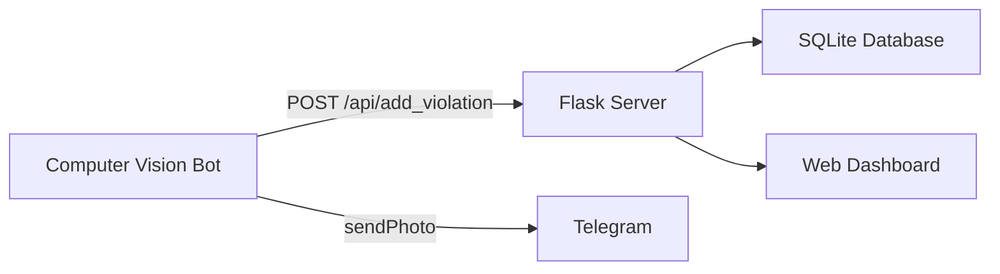

# 🚀 Incident Log System - Пайдалану Нұсқаулығы

## 📋 Шолу

Бұл жүйе Computer Vision ботынан келетін қауіпсіздік бұзушылықтарын веб-дашбордта көрсетеді.

## 🏗️ Жүйе Архитектурасы



## 📁 Файлдар Құрылымы

```
Компьютер вижон/
├── app.py                      # Flask server (Backend)
├── компьютер вижон.py          # CV Bot with web integration
├── requirements.txt            # Python dependencies
├── database.db                 # SQLite database (auto-created)
├── templates/
│   └── incident_log.html       # Frontend dashboard
└── static/
    └── violations/             # Uploaded images (auto-created)
```

## ⚙️ Орнату

### 1. Тәуелділіктерді орнату

```bash
pip install -r requirements.txt
```

Немесе қолмен:

```bash
pip install Flask opencv-python numpy requests
```

## 🚀 Іске қосу

### Қадам 1: Flask серверін іске қосу

Жаңа терминалда:

```bash
cd "c:\Users\Бекжан\Компьютер вижон"
python app.py
```

Сервер мына адрес бойынша жұмыс істейді: **http://localhost:5000**

### Қадам 2: Computer Vision ботын іске қосу

Басқа терминалда:

```bash
python "компьютер вижон.py"
```

## 🌐 Веб-интерфейс

### Dashboard Features

- **📊 Real-time Statistics** - Барлық бұзушылықтар саны
- **🔍 Search & Filter** - Іздеу және сүзгі
- **🖼️ Image Gallery** - Суреттер галереясы
- **💡 Lightbox View** - Суретті үлкейту
- **🗑️ Delete Function** - Жазбаларды өшіру
- **🌙 Dark Mode** - Қараңғы режим

### Басты бет

```
http://localhost:5000
```

## 🔌 API Endpoints

### 1. Бұзушылық қосу

**POST** `/api/add_violation`

Request Body:
```json
{
    "timestamp": "14:30:45 02.02.2026",
    "violation_type": "No Helmet",
    "object_name": "Worker",
    "image_base64": "<base64_encoded_image>"
}
```

Response:
```json
{
    "status": "success",
    "message": "Violation recorded",
    "id": 1
}
```

### 2. Барлық бұзушылықтарды алу

**GET** `/api/violations?limit=50&offset=0`

Response:
```json
{
    "violations": [
        {
            "id": 1,
            "timestamp": "14:30:45 02.02.2026",
            "violation_type": "No Helmet",
            "image_path": "violations/violation_1738491045.jpg",
            "object_name": "Worker",
            "created_at": "2026-02-02 14:30:45"
        }
    ],
    "total": 1,
    "limit": 50,
    "offset": 0
}
```

### 3. Бұзушылықты өшіру

**DELETE** `/api/violations/{id}`

## 🤖 Бот Интеграциясы

### Қалай жұмыс істейді?

1. CV бот каскасыз жұмысшыны анықтайды
2. Суретті `violations/` қалтасына сақтайды
3. Telegram-ға хабарлама жібереді
4. **ЖАҢА:** Веб-серверге POST сұраныс жібереді
5. Сурет base64 форматында серверге жүктеледі
6. Деректер SQLite базасына сақталады
7. Веб-дашбордта автоматты түрде көрінеді

### Integration Code

`send_to_web_server()` функциясы:

```python
def send_to_web_server(image_path, message):
    # Convert image to base64
    with open(image_path, 'rb') as img_file:
        img_data = img_file.read()
        img_base64 = base64.b64encode(img_data).decode('utf-8')
    
    # Send to Flask API
    payload = {
        'timestamp': datetime.now().strftime('%H:%M:%S %d.%m.%Y'),
        'violation_type': 'No Helmet',
        'object_name': 'Worker',
        'image_base64': img_base64
    }
    
    requests.post(WEB_SERVER_URL, json=payload, timeout=5)
```

## 🎨 UI Features

### Card Design
- Қараңғы режим (Dark Mode)
- Glassmorphism эффектілері
- Hover анимациялары
- Responsive дизайн

### Lightbox
- Суретті басқанда үлкейеді
- ESC пернесімен жабылады
- Click outside to close

## 📊 Database Schema

```sql
CREATE TABLE violations (
    id INTEGER PRIMARY KEY AUTOINCREMENT,
    timestamp TEXT NOT NULL,
    violation_type TEXT NOT NULL,
    image_path TEXT NOT NULL,
    object_name TEXT DEFAULT 'Worker',
    created_at DATETIME DEFAULT CURRENT_TIMESTAMP
);
```

## 🔧 Баптаулар

### Flask Server (`app.py`)

```python
# Port өзгерту
app.run(debug=True, host='0.0.0.0', port=5000)

# Max upload size
app.config['MAX_CONTENT_LENGTH'] = 16 * 1024 * 1024
```

### Bot (`компьютер вижон.py`)

```python
# Web server URL
WEB_SERVER_URL = "http://localhost:5000/api/add_violation"

# Telegram credentials
TOKEN = "YOUR_BOT_TOKEN"
CHAT_ID = "YOUR_CHAT_ID"
```

## ⚠️ Маңызды ескертулер

1. **Flask сервер алдымен іске қосылуы керек**
2. Бот сервер жұмыс істемесе де жұмыс жалғастырады (error handling)
3. Суреттер `static/violations/` қалтасында сақталады
4. База `database.db` файлында автоматты құрылады

## 🐛 Troubleshooting

### "Web server is not running" қатесі

```bash
# Flask серверді іске қосыңыз
python app.py
```

### Port busy

```python
# app.py ішінде портты өзгертіңіз
app.run(port=5001)  # 5000 -> 5001
```

### Images not displaying

- `static/violations/` қалтасы бар екенін тексеріңіз
- Файл рұқсаттарын (permissions) тексеріңіз

## 📱 Screenshot

Дашборд мына түрде көрінеді:

- **Header**: Logo, Title, Total Count, Refresh Button
- **Filter Bar**: Search + Type Filter  
- **Grid**: 3 columns of violation cards
- **Card**: Image thumbnail, timestamp, violation type, details button
- **Lightbox**: Full-size image viewer

## 🎯 Келесі қадамдар

Жүйені одан әрі жетілдіру үшін:

1. ✅ User authentication
2. ✅ Export to PDF/Excel
3. ✅ Advanced analytics dashboard
4. ✅ Email notifications
5. ✅ Multi-camera support

---

**Сұрақтарыңыз болса, құжаттаманы қарап шығыңыз немесе код комментарийлерін оқыңыз!** 🚀
